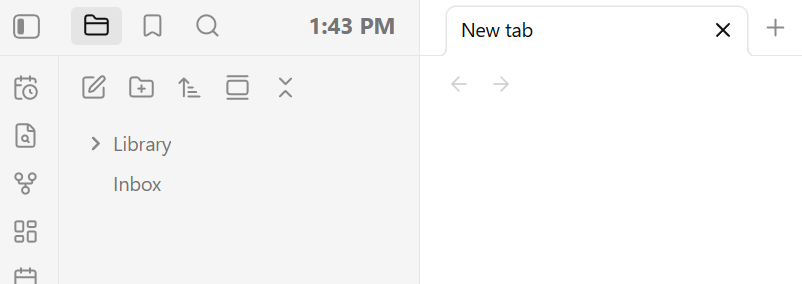
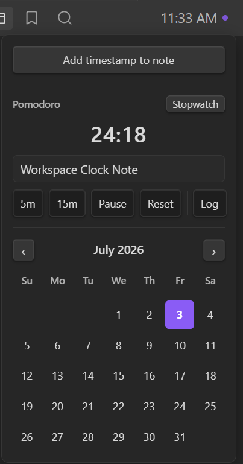

# Workspace Clock

A small clock that lives in Obsidian's left-sidebar header. Click it for a pomodoro timer or switch it to a stopwatch, a monthly calendar wired to your daily notes, and one-click way to drop timestamps and labeled, time-tracked sessions straight into your notes.

It's styled with Obsidian's own CSS variables, no hardcoded colors, so it adopts whatever theme you're using (light or dark, sharp or rounded) and looks native on any theme. An optional accent override in settings takes a custom color or one of six gradient colorways. The theme-native default stays unless changed.

## Features

- **Clock** in the sidebar header (`H:MM AM/PM`), updates every minute
- **Running indicator** - while a stopwatch or countdown runs, a subtle pulsing dot appears next to the clock. Or set the header to show the timer instead of the clock, or both side by side (`10:45 | 25:00`)
- **Click → popup** with:
  - **Add timestamp to note** - drops the current time at cursor in the active note
  - **stopwatch** - Start / Stop / Reset, timestamp-based so it never drifts, plus **Log** to write the elapsed time into the daily or active note
  - **pomodoro / countdown** - switch the display with the button in the timer section's top-right corner. `5m` / `15m` presets, or click the time itself to type any duration (`25`, `25:00`, `1h30m`). Start counts down and fires a notice at zero; Log writes the elapsed portion
  - **session labels** - a label field under the timer, prefilled with the active note's name; logged lines read `- ⏱ 25:00 — plugin docs — logged 5:10 PM`. Clear it to log without a label
  - **run history** - the last 4 stopwatch runs as numbered chips (hover shows the label), click one to load it back into the timer to resume or log it. A live run is saved to history first, never discarded
  - **monthly calendar** wired to daily notes, click any day to open or create its note (Ctrl/Cmd-click opens it in a new tab), days that already have one are dotted, today is highlighted, click the month name to jump back to the current month
- **Persists across reloads** - a running stopwatch or countdown, history, and settings all survive 
- **Theme-adaptive**: colors, accent, and corner radius all follow active theme. Optional accent override: a custom color, or gradient colorways (Forest, Sunset, Ocean, Candy, Ember, Mono, or two custom stops)
- **Lightweight**: one once-per-second timer that only redraws when the minute changes. The stopwatch ticks only while it's running and the popup is open.
- Closes on outside-click or `Esc`

## Settings

**Settings → Community plugins → Workspace Clock**:

- **24-hour time** - show the clock as `HH:MM` instead of `H:MM AM/PM`
- **First day of week** - start the calendar week on Sunday or Monday
- **Timezone** - the clock follows system timezone automatically, override it to
  display a specific zone
- **Session log target** - where the Log button writes, daily note (default) or the active note
- **Header shows while running** - clock + dot (default), timer replaces clock, or `clock | timer` side by side
- **Bold clock** - show the current time in the header in bold
- **Accent** - follow the theme (default), a custom color, or a gradient
- **Colorway** - Forest / Sunset / Ocean / Candy / Ember / Mono, or Custom with two color stops
- **Color the header clock** - apply the accent to the running timer in the header; off by default so the header stays theme-native

Daily-note features respect core Daily Note settings (folder, format, and template — `{{date}}`, `{{time}}`, and `{{title}}` in the template are expanded, including `{{date:FORMAT}}`)

## Commands

All are available in the command palette and can be assigned hotkeys:

- Toggle clock popup
- Start/stop stopwatch
- Reset stopwatch
- Add stopwatch session to note
- Insert timestamp at cursor
- Open today's daily note

## Install (Community Plugins)

1. Open **Settings → Community plugins**.
2. Turn off **Restricted mode** if it's on.
3. Select **Browse**, then search for **Workspace Clock**.
4. Select **Install**, then **Enable**.

## Install (manual)

1. Download `main.js`, `manifest.json`, and `styles.css` from the latest release.
2. Copy them into `<your-vault>/.obsidian/plugins/workspace-clock/`.
3. In Obsidian: **Settings → Community plugins → Installed plugins** enable **Workspace Clock**.

## License

[MIT](LICENSE) © toyotathief
